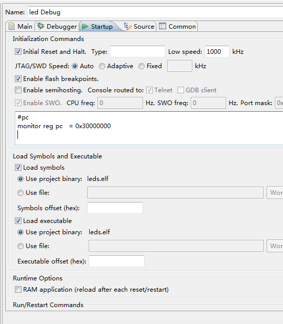
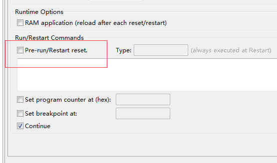

## mini2440 eclipse sdram上运行程序

1. 编写程序 如文件夹led_sdram所示
2. 配置下载如下图



3.初始化命令中填入如下代码
```
#pc
monitor reg pc   = 0x30000000

#watch dog
monitor MemU32 0x53000000 = 0x0

#sdram
monitor MemU32 0x48000000 = 0x22011110
monitor MemU32 0x48000004 = 0x00000700
monitor MemU32 0x48000008 = 0x00000700
monitor MemU32 0x4800000c = 0x00000700
monitor MemU32 0x48000010 = 0x00000700
monitor MemU32 0x48000014 = 0x00000700
monitor MemU32 0x48000018 = 0x00000700
monitor MemU32 0x4800001c = 0x00018005
monitor MemU32 0x48000020 = 0x00018005
monitor MemU32 0x48000024 = 0x008C07A3
monitor MemU32 0x48000028 = 0x000000B1
monitor MemU32 0x4800002c = 0x00000030
monitor MemU32 0x48000030 = 0x00000030
```


4.mini2440使用两片32M bytes的SDRAM，共64M 0x4000000
所以设置堆栈大小为0x34000000

```
    ldr    sp, =0x34000000    @设置堆栈
    bl     main
```